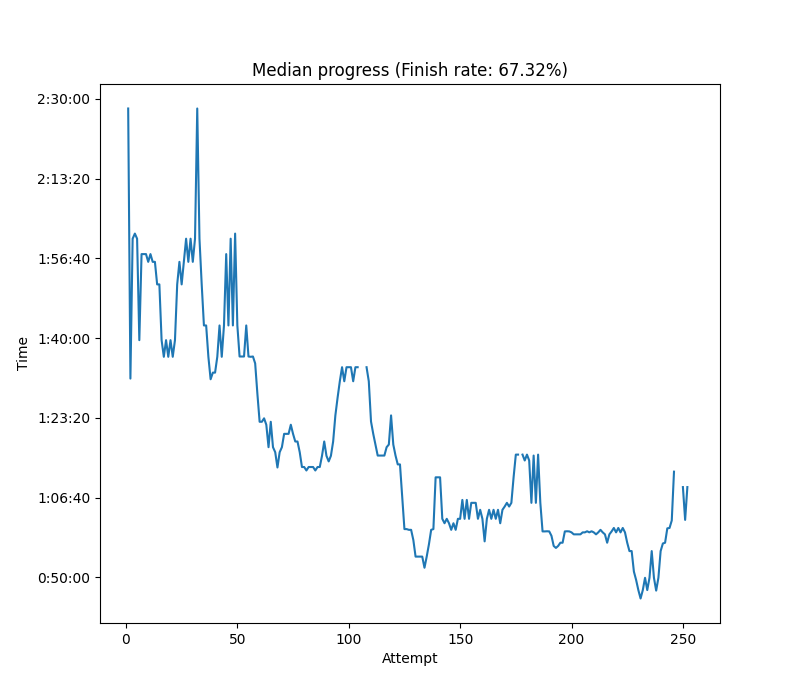

# skillissue

**Visualize your skill progression in a speedrun using your splits file.**

Some speedruns, such as randomizers or otherwise heavily RNG-dependent categories, could use a more accurate measure of skill than your personal best. A statistic such as average or median is much less prone to random variance. This tool provides the means to track and visualize your skill progression with a statistic of your choosing by analyzing your LiveSplit data. The default settings assume a no-reset scenario, where an unfinished run is counted as a forfeit (infinite time). This is to remove bias caused by resetting. For the best results, it is recommended to perform a lot of no-reset runs. You can also drop resets out from the calculation, but the results will not be quite as accurate then.


### Install requirements: ```pip install -r requirements.txt```
### Usage: ```python skillissue.py [-h] [-w WEIGHT] [-m MIN_WEIGHT] [-d] [-s START] [-p PERCENTILE] [-a] [-H] filename```

### Positional arguments
  `filename`: LiveSplit splits file (.lss)

### Options
* `-h`, `--help`: show this help message and exit

* `-w WEIGHT`, `--weight WEIGHT`: Weight decay factor. The lower the values, the more your recent times are prioritized. Values between [0,1]. Default 15/16.

* `-m MIN_WEIGHT`, `--min_weight MIN_WEIGHT`: Increase this to drop old attempts completely. After the weight of a time has decayed to this value, the time will be dropped. Useful with -H. Default 0.

* `-d`, `--drop_missing`: By default, resets are counted as infinite time runs, essentially treating them as forfeits.

* `-s START`, `--start START`: Older attempts than this will not be shown in the resulting graph. Default 1.

* `-p PERCENTILE`, `--percentile PERCENTILE`: Use a different percentile than the default median (0.5). 0 is equal to personal best.

* `-a`, `--use_average`: Uses average instead of percentile for calculations. Forces -d and ignores -p.

* `-H`, `--hist`, `--histogram`: Output a histogram visualizing the distribution of your times instead of a progression chart. Forces -d and ignores -p and -a.

* `-r REMAKE_WINDOW`, `--remake_window REMAKE_WINDOW`: Number of seconds during which resets at the start of a run are not counted as a forfeit. Default 0.

 * `-P`, `--per_split`: Generate the output splitwise instead of based on the finish times. Stores the splitwise plots in ./skillissue_output and shows an aggregate plot of all splits.

*   `-n N_SIMS`, `--n_sims N_SIMS`:  Specify how many simulations to perform when generating an aggregate splitwise histogram. Default 1000.

*   `-g`, `--game_time`: Use LiveSplit GameTime instead of RealTime. Proceed with caution if using with -r, as that is still using real time.

### Sample graph


